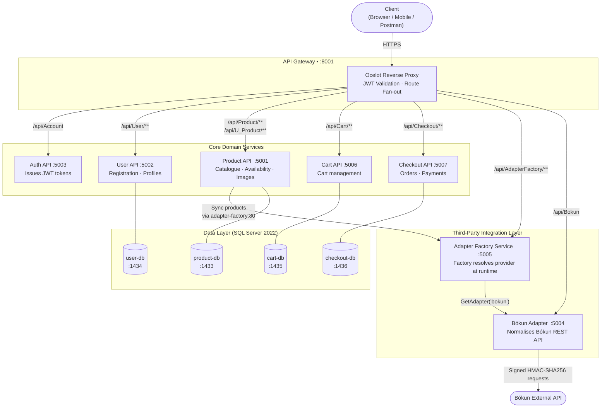

# Multi-Tenant Adapter Factory — Microservices Platform

> A production-ready .NET microservices system built around the **Adapter + Factory design patterns**, enabling plug-and-play integration with multiple third-party tour/experience providers (e.g. Bókun) behind a unified API surface.

---

## Key Highlights

| Area | Detail |
|---|---|
| **Pattern** | Adapter + Factory (GoF Design Patterns) |
| **Architecture** | Microservices with API Gateway |
| **Gateway** | Ocelot (reverse proxy + JWT auth) |
| **Auth** | JWT Bearer tokens via shared `JwtAuthenticationManager` library |
| **Data** | SQL Server 2022 — one isolated database per service |
| **Containerisation** | Docker Compose (fully orchestrated, single-command spin-up) |
| **Language / Runtime** | C# · ASP.NET Core 8 |

---

## Architecture



---

## Adapter + Factory Pattern — How It Works

The centrepiece of this system is a clean implementation of the **GoF Adapter and Factory Method** patterns:

```
IProductProviderAdapter          ← contract every provider must implement
    ├── GetProductAsync()
    ├── GetAllProductsAsync()
    ├── GetAvailabilityAsync()
    └── GetAvailabilityRawAsync()

IProductAdapterFactory           ← factory interface
    └── GetAdapter(provider: string) → IProductProviderAdapter

ProductAdapterFactory            ← concrete factory
    └── "bokun" → BokunProductProviderAdapter   (new providers = one new class)
```

Adding a new provider (e.g. `"viator"`, `"rezdy"`) requires **zero changes to existing code** — only a new `IProductProviderAdapter` implementation and a single switch branch in the factory.

---

## Project Structure

```
multi-tenant-adapter-factory/
│
├── ApiGateway/                   # Ocelot gateway — routing + JWT validation
├── AuthenticationWebApi/         # Issues JWT bearer tokens
├── JwtAuthenticationManager/     # Shared JWT library (NuGet-ready class lib)
│
├── UserWebApi/                   # User registration & profile management
├── ProductWebAPI/                # Product catalogue, categories, availability
├── CartWebAPI/                   # Shopping cart CRUD
├── CheckoutWebAPI/               # Order placement & management
│
├── AdapterFactoryService/        # ← Factory pattern core
│   └── Adapters/
│       ├── Factories/            # IProductAdapterFactory + concrete factory
│       └── Providers/            # IProductProviderAdapter + BokunAdapter impl
│
├── BokunAdapter/                 # Standalone Bókun microservice
│   └── Services/BokunService.cs  # HMAC-SHA256 signed calls to Bókun REST API
│
└── docker-compose.yml            # Full orchestration (11 containers)
```

---

## Running Locally

**Prerequisites:** Docker Desktop

```bash
# Clone and spin up the entire platform
git clone https://github.com/<your-username>/multi-tenant-adapter-factory.git
cd multi-tenant-adapter-factory

docker compose up --build
```

| Service | URL |
|---|---|
| API Gateway | http://localhost:8001 |
| Product API (direct) | http://localhost:5001/swagger |
| User API (direct) | http://localhost:5002/swagger |
| Auth API (direct) | http://localhost:5003/swagger |
| Bókun Adapter (direct) | http://localhost:5004/swagger |
| Adapter Factory (direct) | http://localhost:5005/swagger |
| Cart API (direct) | http://localhost:5006/swagger |
| Checkout API (direct) | http://localhost:5007/swagger |

---

## Authentication Flow

```
POST /api/Account          → receive JWT
Add header: Authorization: Bearer <token>
Access protected routes    → /api/Product, /api/Checkout, /api/AdapterFactory, …
```

JWT validation is handled centrally at the **Ocelot gateway** using the shared `JwtAuthenticationManager` class library — downstream services remain stateless.

---

## Design Patterns Used

| Pattern | Where |
|---|---|
| **Factory Method** | `ProductAdapterFactory` resolves provider adapters by name at runtime |
| **Adapter** | `BokunProductProviderAdapter` translates Bókun's API schema to the internal contract |
| **Repository / Service Layer** | Each domain service separates data access from controller logic |
| **API Gateway** | Ocelot centralises routing, auth, and load-balancing concerns |
| **Database-per-Service** | Each microservice owns its SQL Server database — no shared schemas |

---

## Tech Stack


